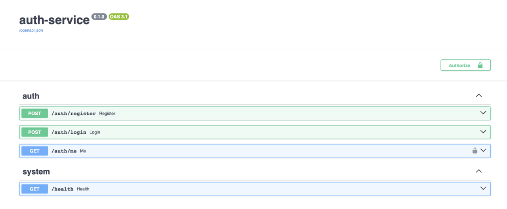
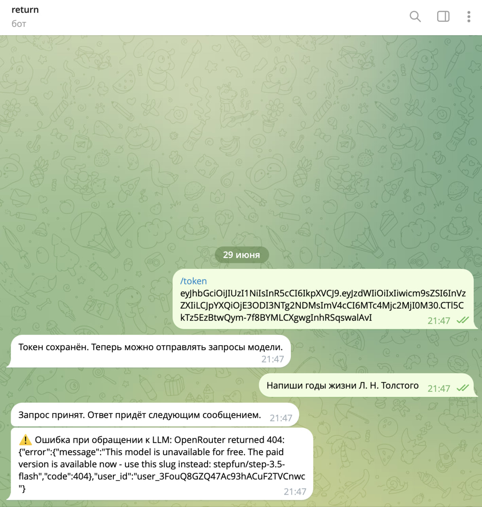
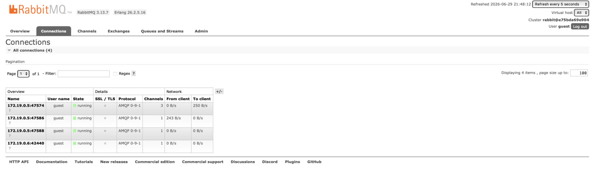
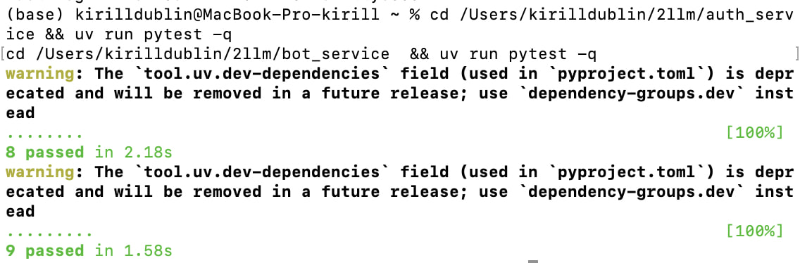

# Двухсервисная система LLM-консультаций

Распределённая система из двух независимых сервисов, построенная по принципу
разделения ответственности:

- **Auth Service** (FastAPI) — регистрация, логин и выпуск JWT-токенов.
- **Bot Service** (aiogram + Celery) — Telegram-бот, который доверяет только
  корректно подписанному и не истёкшему JWT и выполняет LLM-консультации
  асинхронно через очередь.

Telegram-бот ничего не знает о пользователях, паролях и регистрации. Он только
**проверяет** JWT, выданный Auth Service.

## Архитектура

```
                 ┌─────────────────────┐
   Swagger ─────▶│   Auth Service       │   SQLite/Postgres
  (register/     │   FastAPI :8000      │◀──── users (email, hash, role)
   login/me)     │   выпускает JWT      │
                 └─────────────────────┘
                            │  JWT (HS256)
                            ▼
  Telegram ──▶ /token <JWT> ──▶ ┌──────────────────┐
  Telegram ──▶ обычный текст ──▶│   Bot Service     │
                                │   aiogram         │
                                │  1. валидирует JWT │──▶ Redis (token:<tg_id>)
                                │  2. publish task   │
                                └─────────┬─────────┘
                                          │ llm_request.delay()
                                          ▼
                                  ┌───────────────┐   broker
                                  │   RabbitMQ     │◀── Celery
                                  └───────┬───────┘
                                          ▼
                                ┌──────────────────┐
                                │  Celery worker    │──▶ OpenRouter (LLM)
                                │  llm_request      │──▶ Redis (result backend)
                                └─────────┬────────┘
                                          │ Telegram sendMessage
                                          ▼
                                      Пользователь
```

**Роли инфраструктуры:**

- **RabbitMQ** — брокер задач Celery. Bot Service публикует задачу `llm_request`,
  воркер её забирает. Запрос к LLM никогда не выполняется в самом хэндлере бота.
- **Redis** — (1) result backend Celery и (2) хранилище состояния: привязка
  JWT к Telegram `user_id` по ключу `token:<tg_user_id>`.

## Сервис 1. Auth Service

FastAPI + Swagger на `http://0.0.0.0:8000/docs`.

| Метод | Путь             | Назначение                          |
|-------|------------------|-------------------------------------|
| POST  | `/auth/register` | Создаёт пользователя                |
| POST  | `/auth/login`    | Возвращает JWT (OAuth2 form-data)   |
| GET   | `/auth/me`       | Профиль по `Authorization: Bearer`  |
| GET   | `/health`        | Проверка состояния сервиса          |

- Пароли хранятся только в виде bcrypt-хеша (passlib).
- JWT содержит `sub` (id пользователя), `role`, `iat`, `exp`.
- Слои: `api → usecases → repositories → db`. Исключения — типизированные
  (`UserAlreadyExistsError` 409, `InvalidCredentialsError` 401,
  `InvalidTokenError`/`TokenExpiredError` 401, `UserNotFoundError` 404,
  `PermissionDeniedError` 403).

## Сервис 2. Bot Service

- `/token <JWT>` — валидирует токен и сохраняет в Redis под `token:<tg_user_id>`.
- Обычный текст — проверяет токен, публикует `llm_request` в RabbitMQ, отвечает
  «Запрос принят». Без токена — отказ и инструкция авторизоваться.
- `core/jwt.py` только проверяет токен (`decode_and_validate`); токены здесь не
  создаются.
- Celery worker вызывает OpenRouter и отправляет ответ пользователю.

## Запуск через Docker Compose

```bash
# 1. Создайте .env из шаблонов и заполните секреты
cp auth_service/.env.example auth_service/.env
cp bot_service/.env.example  bot_service/.env

# 2. В bot_service/.env впишите:
#    TELEGRAM_BOT_TOKEN=...   (из @BotFather)
#    OPENROUTER_API_KEY=...   (из openrouter.ai)

# 3. Поднимите всю систему
docker compose up --build
```


Поднимаются: `rabbitmq` (UI на http://localhost:15672, guest/guest),
`redis`, `auth` (:8000), `bot` (polling) и `worker` (Celery).

## Локальный запуск (без Docker)

Каждый сервис управляется через `uv`.

**Auth Service:**
```bash
cd auth_service
uv sync
uv run uvicorn app.main:app --host 0.0.0.0 --port 8000
# Swagger: http://0.0.0.0:8000/docs
```

**Bot Service** (нужны запущенные RabbitMQ и Redis):
```bash
cd bot_service
uv sync
uv run celery -A app.infra.celery_app.celery_app worker --loglevel=info   # терминал 1
uv run python -m app.bot.run                                              # терминал 2
```

## Тесты

Тесты не требуют Docker и внешних сервисов (используются `fakeredis`,
`pytest-mock`, `respx`, in-memory SQLite).

```bash
cd auth_service && uv run pytest -q   # 8 passed
cd bot_service  && uv run pytest -q   # 9 passed
```

**Auth Service:**
- `test_security.py` — unit: хеширование/проверка паролей, генерация и
  декодирование JWT (`sub`, `role`, `iat`, `exp`).
- `test_auth_flow.py` — integration через httpx ASGITransport: полный поток
  register → login → me, плюс негативные (409, 401 неверный пароль, 401 без
  токена, 401 неверный токен).

**Bot Service:**
- `test_jwt.py` — unit: валидный токен, мусорная строка, истёкший токен, токен
  без `sub`.
- `test_handlers.py` — mock: `/token` сохраняет в fakeredis; текст без токена не
  вызывает Celery; текст с токеном вызывает `llm_request.delay(...)` с верными
  аргументами.
- `test_openrouter.py` — integration через respx: корректный разбор ответа и
  ошибка на не-200.

## Пользовательский сценарий

1. Зарегистрироваться и залогиниться в Auth Service через Swagger, получить JWT.
2. Отправить боту `/token <JWT>` — бот сохраняет токен в Redis.
3. Отправлять вопросы — бот публикует задачу в RabbitMQ, воркер обращается к
   LLM и присылает ответ. Без валидного токена доступ запрещён.

## Скриншоты работы


### 1. Swagger Auth Service (register, login, /auth/me)



### 2. Работа Telegram-бота (/token + ответ LLM)



### 3. Интерфейс RabbitMQ (очереди и consumers)



### 4. Успешный прогон тестов


